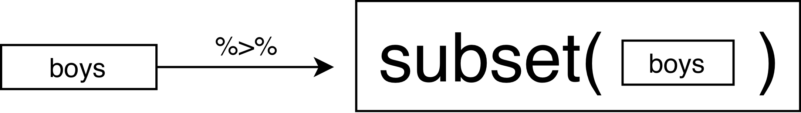

```{r setup, include=FALSE}
knitr::opts_chunk$set(echo = TRUE)
```

## This lecture

1. Course overview
2. Introduction to data science
3. Some examples
4. Pipes in `R`
5. Visualization with `ggplot2`

## Disclaimer
When figures and other external sources are shown, the references are included when the origin is known. 

## Course page
You can find all materials at the following location:

<center>[https://www.gerkovink.com/erasmus/](https://www.gerkovink.com/erasmus/)</center>
<br>

The MS Teams environment can be found [here](https://teams.microsoft.com/l/team/19%3acJ7cqmjMsevHNAIEK7FO_TM2uXdukr31Xgt5dLJIewY1%40thread.tacv2/conversations?groupId=289eef31-44e1-47f8-ab40-47ff3d15b78a&tenantId=d72758a0-a446-4e0f-a0aa-4bf95a4a10e7). Participants can [join the meeting online here](https://teams.microsoft.com/l/meetup-join/19%3a3e0266cc850f494f8f242f362f79f56f%40thread.tacv2/1635875455722?context=%7b%22Tid%22%3a%22d72758a0-a446-4e0f-a0aa-4bf95a4a10e7%22%2c%22Oid%22%3a%22cc7d7fcd-73aa-4668-936a-2ca38cace0f3%22%7d)

# Course overview

## About me

- Name: Gerko Vink
- Identifies as: `Dark data` scientist
- Studied to be: Psychologist
- Landed in: Statistics
- Enjoys: Putting easter eggs in software
- Pet peeve: Excessively certain Data Scientists
- Married, with 2 kids
- Favorite guitarist: Jimmy Page
- Still has mortgage

Expertise: Missing data theory, statistical programming, computational evaluation

## Topics

| Week # | Focus | 
|--------|---------------------|
| 1 | Intro, modeling and regression |
| 2 | Classification and Crossvalidation |
| 3 | Regularisation |
| 4 | Support Vector Machines and non-linear predictions |

## Schedule
<center>
{width=50%}
</center>

# Introduction to SLV

## Goals in data analysis

- **Description**: <br> What happened?
- **Prediction**: <br> What will happen?
- **Explanation**: <br> Why did/does something happen?
- **Prescription**: <br> What should we do?

## In this course
- **Exploratory Data Analysis**: <br> 
Describing interesting patterns: use graphs, summaries, to understand
subgroups, detect anomalies, understand the data <br>
Examples: boxplot, five-number summary, histograms, missing data plots, ...

- **Supervised learning**: <br>
Regression: predict continuous labels from other values.<br>
Examples: linear regression, support vector machines, regression trees, ... <br> Classification: predict discrete labels from other values. <br>
Examples: logistic regression, knn, ...

<center>
{width=50%} <br>
[image source](https://www.researchgate.net/publication/326175998_Analysis_of_Control_Attainment_in_Endogenous_Electroencephalogram_Based_Brain_Computer_Interfaces)
</center>

## Exploratory Data Analysis workflow
<center>
 <br>
[image source](https://www.researchgate.net/publication/326175998_Analysis_of_Control_Attainment_in_Endogenous_Electroencephalogram_Based_Brain_Computer_Interfaces)
</center>

## Data analysis

How do you think that `data analysis` relates to:

- “Data analytics”?
- “Data modeling”?
- “Machine learning”?
- “Statistical learning”?
- “Statistics”?
- “Data science”?
- “Data mining”?
- “Knowledge discovery”?

## Explanation

People from different fields (such as statistics, computer science, information science, industry) have different goals and different standard approaches.

- We often use the same techniques.
- We just use different terms to highligh different aspects of so-called `data analysis`. 
- All the terms on the previous slides are not exact synonyms. 
- But according to most people they carry the same analytic intentions. 

In this course we emphasize on **drawing insights that help us understand the data.**

# Some examples

## Challenger disaster
<center>
{width=100%}
</center><br>
[Source: wikimedia commons](https://en.wikipedia.org/wiki/File:Challenger_explosion.jpg) and [MIMP summerschool slide 28](https://www.gerkovink.com/mimp/Contents/Lectures/MIMP2021-slides.pdf)

Challenger space shuttle - 28 Jan 1986 - 7 deaths

## How wages differ
<center>
{width=70%}
</center> <br>
[Source: ISLR2, pp. 2](https://web.stanford.edu/~hastie/ISLR2/ISLRv2_website.pdf)


## The origin of cholera
<center>
{width=100%} <br>
[Source: wikimedia commons](https://nl.wikipedia.org/wiki/John_Snow)
</center>

## Google Flu Trends
Google used a linear model to calculate the log-odds of Influence-like illness (ILI) physician visit and the log-odds of ILI-related search queries per
$$\operatorname{logit}(P)=\beta _{0}+\beta _{1}\times \operatorname{logit}(Q)+\epsilon$$
where $P$ is the percentage of ILI physician visit and $Q$ is the ILI-related query fraction computed. 
<center>
{width=70%} <br>
</center>
[Ginsberg, J., Mohebbi, M., Patel, R. et al. Detecting influenza epidemics using search engine query data. Nature 457, 1012–1014 (2009)](https://www.nature.com/articles/nature07634)

## Bad performance
<center>
{width=100%} <br>
</center>

## Bad performance
<center>
{width=90%} <br>
</center>

## Why analysis and visualization in data science?

- When high risk decisions are at hand, it paramount to analyze the correct data. 

- When thinking about important topics, such as whether to stay in school, it helps to know that more highly educated people tend to earn more, but also that there is no difference for top earners.

- Before John Snow, people thought “miasma” caused cholera and they fought it by airing out the house. It was not clear whether this helped or not, but people thought it must because “miasma” theory said so.

- If we know flu is coming two weeks earlier than usual, that’s just enough time to buy shots for very weak people.

The above examples have in common that data analysis and the accompanying visualizations have yielded insights and solved problems that could not be solved without them.

-  On some level, humans do nothing but analyze data;
-  They may not do it consistently, understandibly, transparently, or correctly,
however;
-  Data analyses and visualizations help us process more data, and can keep us honest;
-  Data analysis and visualizations can also exacerbate our biases when we are not careful.

## Thought
<center>
{width=90%}
</center>
[Source: Mike Lee](https://www.mikelee.co/animation/2017-06-28-wsj-measles-vaccination-chart/)

# Data wrangling

## Wrangling in the pipeline

Data wrangling is the process of transforming and mapping data from one "raw" data form into another format. 
  - The process is often iterative
  - The goal is to add purpose and value to the data in order to maximize the downstream analytical gains

<center>
{width=100%}
</center>
[Source: R4DS](https://r4ds.had.co.nz/wrangle-intro.html)

## Core ideas
- **Discovering**: The first step of data wrangling is to gain a better understanding of the data: different data is worked and organized in different ways.
- **Structuring**:The next step is to organize the data. Raw data is typically unorganized and much of it may not be useful for the end product. This step is important for easier computation and analysis in the later steps.
- **Cleaning**: There are many different forms of cleaning data, for example one form of cleaning data is catching dates formatted in a different way and another form is removing outliers that will skew results and also formatting null values. This step is important in assuring the overall quality of the data.
- **Enriching**: At this step determine whether or not additional data would benefit the data set that could be easily added.
- **Validating**: This step is similar to structuring and cleaning. Use repetitive sequences of validation rules to assure data consistency as well as quality and security. An example of a validation rule is confirming the accuracy of fields via cross checking data.
- **Publishing**: Prepare the data set for use downstream, which could include use for users or software. Be sure to document any steps and logic during wrangling.

[Source: Trifacta](https://www.trifacta.com/data-wrangling/)

# Some scripting and coding 

# Pipes

## This is a pipe:

```{r eval = FALSE}
boys <- 
  read_csv("boys.txt") %>%
  head()
```

It effectively replaces `head(read_csv("boys.txt"))`.

</img>

## With pipes
Your code becomes more readable:

- data operations are structured from left-to-right and not from in-to-out
- nested function calls are avoided
- local variables and copied objects are avoided
- easy to add steps in the sequence

Benefit: a single object in memory that is easy to interpret

## The standard `%>%` pipe
<center>

</center>

## The `%$%` pipe
<center>

</center>

## The `%T>%` pipe
<center>

</center>

```{r echo = FALSE, message = FALSE, warning=FALSE}
library(mice)
library(magrittr)
library(ggplot2)

```

## The role of `.` in a pipe
In `a %>% b(arg1, arg2, arg3)`, `a` will become `arg1`. With `.` we can change this.
```{r error=TRUE}
mice::boys %>% 
  lm(age ~ hgt)
```
VS
```{r}
mice::boys %>% 
  lm(age ~ hgt, data = .)
```

The `.` can be used as a placeholder in the pipe. 

# Visualization 101

## Why visualise?

- We can process a lot of information quickly with our eyes
- Plots give us information about
    - Distribution / shape
    - Irregularities
    - Assumptions
    - Intuitions
- Summary statistics, correlations, parameters, model tests, *p*-values do not tell the whole story

### ALWAYS plot your data!


## Why visualise?

</img>
<p style="text-align:center;font-style:italic;font-size:0.5em;">Source: Anscombe, F. J. (1973). "Graphs in Statistical Analysis". American Statistician. 27 (1): 17–21.</p>


## Why visualise?

</img>


<p style="text-align:center;font-style:italic;font-size:0.5em;">Source: https://www.autodeskresearch.com/publications/samestats</p>

# ggplot2

## What is `ggplot2`?
Layered plotting based on the book **The Grammer of Graphics** by Leland Wilkinsons.

With `ggplot2` you

1. provide the _data_
2. define how to map variables to _aesthetics_
3. state which _geometric object_ to display
4. (optional) edit the overall _theme_ of the plot

`ggplot2` then takes care of the details

## An example: scatterplot

1: Provide the data
```{r, eval=FALSE}
boys %>%
  ggplot()
```

2: map variable to aesthetics
```{r, eval=FALSE}
boys %>%
  ggplot(aes(x = age, y = bmi))
```

3: state which geometric object to display
```{r, eval=FALSE}
boys %>%
  ggplot(aes(x = age, y = bmi)) +
  geom_point()
```

## An example: scatterplot
```{r, echo=FALSE, fig.align='center'}
boys %>%
  ggplot(aes(x = age, y = bmi)) +
  geom_point(na.rm = TRUE)
```

## Why this syntax?

Create the plot
```{r, fig.align='center', dev.args=list(bg="transparent"), warning=FALSE, message=FALSE}
gg <- 
  boys %>%
  ggplot(aes(x = age, y = bmi)) +
  geom_point(col = "dark green")
```

Add another layer (smooth fit line)
```{r, warning=FALSE, message=FALSE, fig.align='center', dev.args=list(bg="transparent")}
gg <- gg + 
  geom_smooth(col = "dark blue")
```

Give it some labels and a nice look
```{r, fig.align='center', dev.args=list(bg="transparent")}
gg <- gg + 
  labs(x = "Age", y = "BMI", title = "BMI trend for boys") +
  theme_minimal()
```

## Why this syntax?
```{r, warning=FALSE, message=FALSE, fig.align='center', dev.args=list(bg="transparent")}
plot(gg)
```

## Why this syntax?
</img>

## For fun
<center> 
{width=40%}
</center>
[source](https://www.reddit.com/r/ProgrammerHumor/comments/8za9b6/hello_i_am_your_server_for_today/)


