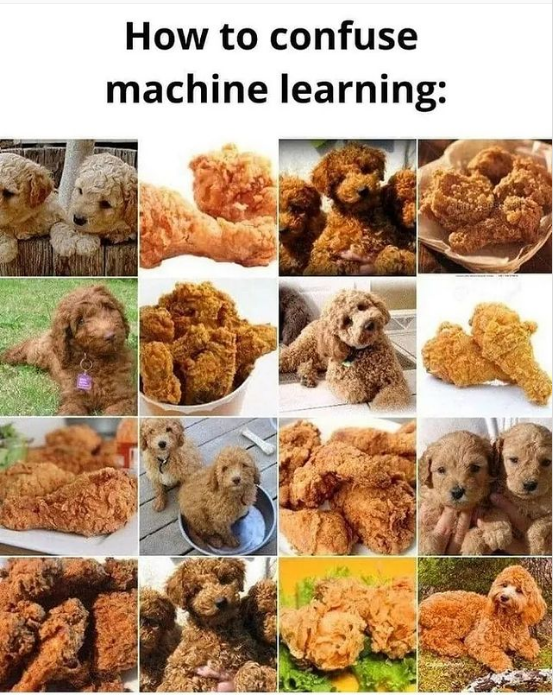

## This lecture
- squared deviations
- linear modeling
- assumptions associated with the linear model

##  We use the following packages
```{r message=FALSE}
library(dplyr)
library(magrittr)
library(ggplot2)
library(mice)
```

# Squared deviations

## We have already met deviations before

- correlations

$$\rho_{X,Y} = \frac{\mathrm{cov}(X,Y)}{\sigma_X\sigma_Y} = \frac{\mathrm{E}[(X - \mu_X)(Y-\mu_Y)]}{\sigma_X\sigma_Y}.$$

- t-test

$$t = \frac{\bar{X}-\mu}{\hat{\sigma}/\sqrt{n}}.$$

- variance

$$\sigma^2_X = \mathrm{E}[(X - \mu)^2].$$

## Deviations

Deviations tell what the distance is for each value (`observation`) to a comparison/reference value. 

 - often, the mean is chosen as a the reference. 
 
### Why the mean?

The arithmetic mean is a very informative measure:

- it is the average
- it is the mathematical expectation
- it is the central value of a set of discrete numbers

$$ $$
\[\text{The mean itself is a model: observations are}\]
\[\text{merely  a deviation from that model}\]

## The mean as a center
```{r echo=FALSE}
library(ggplot2)
set.seed(123)
plotdata <- data.frame(X = rnorm(100, 167.5, 10),
           Y = rnorm(100, 180.8, 10)) 
plotdata %>%
  ggplot(aes(X, Y)) + 
  geom_point(color = "blue") + 
  geom_point(aes(mean(X), mean(Y)), color = "orange", size = 5) + 
  geom_vline(xintercept = 168.4041, color = "orange") + 
  geom_hline(yintercept = 179.7245 , color = "orange") + 
  ggtitle(bquote("Bivariate normal")) + 
  theme_minimal()
```

## Deviations from the mean
```{r echo=FALSE, warning=FALSE}
plotdata %>%
  ggplot(aes(X, Y)) + 
  geom_point(color = "blue") + 
  geom_point(aes(mean(X), mean(Y)), color = "orange", size = 5) + 
  geom_segment(aes(xend = 168.4041, yend = Y), color = "orange", lty = 2, alpha = .5) +
  geom_vline(xintercept = 168.4041, color = "orange") + 
  ggtitle(bquote("Univariate" ~X )) + 
  theme_minimal()
```

## Plotting the deviations
```{r echo=FALSE, warning=FALSE}
plotdata %>%
  mutate(deviation = X-mean(X)) %>%
  ggplot(aes(deviation)) + 
  geom_density(color = "blue") + 
  geom_vline(xintercept = 0, color = "orange") + 
  ggtitle(expression(X - bar(X))) + xlab("Deviation from the mean X") + 
  theme_minimal()
```

## Use of deviations
Deviations summarize the fit of all the points in the data to a single point

The mean is the mathematical expectation. It represents the observed values best for a normally distributed univariate set.
 
 - The mean yields the lowest set of deviations
```{r}
plotdata %>%
  mutate("Mean" = X - mean(X), 
         "Mean + 3" = X - (mean(X) + 3)) %>%
  select("Mean", "Mean + 3") %>%
  colSums %>%
  round(digits = 3)
```

The mean minimizes the deviations

## What happens
```{r echo=FALSE}
plotdata %>%
  mutate(deviation = X - mean(X), 
         deviation2 = X - (mean(X) + 3)) %>%
  ggplot() + 
  geom_density(aes(deviation), color = "blue") + 
  geom_density(aes(deviation2), color = "orange") + 
  geom_vline(xintercept = -3, color = "orange") +  
  geom_vline(xintercept = 0, color = "blue") +  
  ggtitle(expression(paste("Deviations from ", bar(X), " (blue) and ", bar(X) + 3, " (orange)")))+
  theme_minimal()
```

## Plotting the standardized deviations
```{r echo=FALSE}
plotdata %>%
  mutate(deviation = (X-mean(X))/sd(X)) %>%
  ggplot(aes(deviation)) + 
  geom_density(color = "blue") + 
  geom_vline(xintercept = 0, color = "orange") + 
  ggtitle(expression((X - bar(X)) / sigma(X))) + xlab("Standardized deviation from the mean X") + 
  theme_minimal()
```

## Plotting the squared deviations
```{r echo=FALSE}
plotdata %>%
  mutate(deviation = (X-mean(X))^2) %>%
  ggplot(aes(deviation)) + 
  geom_density(color = "blue") + 
  geom_vline(xintercept = 0, color = "orange") + 
  ggtitle(expression((X - bar(X))^2)) + xlab("Squared deviation from the mean X") + 
  theme_minimal()
```

## Why squared deviations are useful

Throughout statistics we make extensive use of squaring. 
$$ $$
\[\text{WHAT ARE THE USEFUL PROPERTIES OF SQUARING}\]
\[\text{THAT STATISTICIANS ARE SO FOND OF?}\]

## Deviations from the mean
```{r echo=FALSE}
plotdata %>%
  ggplot(aes(X, Y)) + 
  geom_point(color = "blue") + 
  geom_point(aes(mean(X), mean(Y)), color = "orange", size = 5) +   
  geom_segment(aes(xend = X, yend = 179.7245), color = "orange", lty = 2, alpha = .5) + 
  geom_hline(yintercept = 179.7245, color = "orange") +
  ggtitle(bquote("Univariate" ~Y ))
```

## Deviations from the mean
```{r echo=FALSE, warning=FALSE}
plotdata %>%
  ggplot(aes(X, Y)) + 
  geom_point(color = "blue") + 
  geom_point(aes(mean(X), mean(Y)), color = "orange", size = 5) + 
  geom_segment(aes(x = X, y = Y, xend = mean(X), yend = mean(Y)), color = "orange", lty = 2, alpha = .5) +
  ggtitle("Multivariate (X, Y)") + 
  theme_minimal()
```

## Least squares solution
```{r echo=FALSE, message=FALSE, warning=FALSE}
fit <- plotdata %$%
  lm(Y~X)

plotdata %>%
  mutate(predicted = predict(fit),
          residuals = residuals(fit)) %>%
  ggplot(aes(X, Y)) +
  geom_smooth(method = "lm", se = FALSE, color = "orange") +
  geom_segment(aes(xend = X, yend = predicted), color = "orange", alpha = .5) +
  geom_point(aes(color = abs(residuals))) + 
  scale_color_continuous(low = "blue", high = "red") +  
  guides(color = FALSE) +  
  geom_point(aes(y = predicted), shape = 1, color = "orange") +
  ggtitle("Multivariate (X, Y)") + 
  theme_minimal()
```

## Least squares solution
```{r echo=FALSE, message=FALSE, warning=FALSE}
plotdata2 <- data.frame(X = rnorm(100, 167.5, 10)) %>%
  mutate(Y = rnorm(100, 0, 10) - X + 335)

fit <- plotdata2 %$%
  lm(Y~X)

 plotdata2 %>%
   mutate(predicted = predict(fit),
          residuals = residuals(fit)) %>%
  ggplot(aes(X, Y)) +
  geom_smooth(method = "lm", se = FALSE, color = "orange") +
  geom_segment(aes(xend = X, yend = predicted), color = "orange", alpha = .5) +
  geom_point(aes(color = abs(residuals))) + 
  scale_color_continuous(low = "blue", high = "red") +  
  guides(color = FALSE) +  
  geom_point(aes(y = predicted), shape = 1, color = "orange") +
  ggtitle("Multivariate (X, Y), higher correlation") +
  theme_minimal()
```

# Fitting a line to data

##  Linear regression
Linear regression model
\[
y_i=\alpha+\beta{x}_i+\varepsilon_i
\]

Assumptions:

  -  $y_i$ conditionally normal with mean $\mu_i=\alpha+\beta{x}_i$
  -  $\varepsilon_i$ are $i.i.d.$ with mean 0 and (constant) variance $\sigma^2$

## The `anscombe` data
```{r}
anscombe
```

##  Fitting a line {.smaller}
```{r eval = FALSE, message = FALSE}
anscombe %>%
  ggplot(aes(y1, x1)) + 
  geom_point() + 
  geom_smooth(method = "lm")
```

##  Fitting a line {.smaller}

```{r echo=FALSE, message = FALSE}
anscombe %>%
  ggplot(aes(y1, x1)) + 
  geom_point() + 
  geom_smooth(method = "lm")
```


##  Fitting a line {.smaller}
The linear model would take the following form:
```{r eval=FALSE}
fit <- 
  yourdata %>%
  lm(youroutcome ~ yourpredictors)

fit %>% summary() # pipe
summary(fit) # base R
```
Output:

-  Residuals: minimum, maximum and quartiles
-  Coefficients: estimates, SE's, t-values and $p$-values
-  Fit measures
    -  Residuals SE (standard error residuals)
    -  Multiple R-squared (proportion variance explained)
    -  F-statistic and $p$-value (significance test model)

##  `anscombe` example {.smaller}
```{r message=FALSE, warning = FALSE}
fit <- anscombe %$%
  lm(y1 ~ x1)

fit %>% summary
```

# Assumptions

## The key assumptions
There are four key assumptions about the use of linear regression models. 

In short, we assume 

- The outcome to have a **linear relation** with the predictors and the predictor relations to be **additive**. 
  - the expected value for the outcome is a straight-line function of each predictor, given that the others are fixed. 
  - the slope of each line does not depend on the values of the other predictors
  - the effects of the predictors on the expected value are additive
  
  $$ y = \alpha + \beta_1X_1 + \beta_2X_2 + \beta_3X_3 + \epsilon$$

- The residuals are statistically **independent**
- The residual **variance is constant**
  - accross the expected values
  - across any of the predictors
- The residuals are **normally distributed** with mean $\mu_\epsilon = 0$

## A simple example
$$y = \alpha + \beta X + \epsilon$$ and $$\hat{y} = \alpha + \beta X$$
As a result, the following components in  linear modeling

- outcome $y$
- predicted outcome $\hat{y}$
- predictor $X$
- residual $\epsilon$

can also be seen as columns in a data set. 

## As a data set
As a data set, this would be the result for `lm(y1 ~ x1, data = anscombe)`
```{r echo=FALSE}
library(DT)
fit <- anscombe %$%
  lm(y1 ~ x1)
data.frame(y1 = anscombe$y1, 
           y1.hat = fit$fitted.values,
           residuals = fit$residuals,
           x1 = anscombe$x1) %>% datatable
```

## An example
```{r echo=FALSE, warning = FALSE, message=FALSE}
set.seed(123)
plotdata2 <- data.frame(X = rnorm(100, 167.5, 10)) %>%
  mutate(Y = rnorm(100, 0, 10) - X + 335)

fit <- plotdata2 %$%
  lm(Y~X)

 plotdata2 %>%
   mutate(predicted = predict(fit),
          residuals = residuals(fit)) %>%
  ggplot(aes(X, Y)) +
  geom_smooth(method = "lm", se = FALSE, color = "orange") +
  #geom_hline(yintercept = 167.5, color = "purple") + 
  #geom_abline(intercept = 310, slope = -1.045, color = "purple") + 
  geom_segment(aes(xend = X, yend = predicted), color = "orange", alpha = .5) +
  geom_point(aes(color = abs(residuals))) + 
  scale_color_continuous(low = "blue", high = "red") +  
  guides(color = FALSE) +  
  geom_point(aes(y = predicted), shape = 1, color = "orange") +
  theme_minimal()
```

## Residual variance
```{r echo=FALSE, warning = FALSE, message=FALSE}
fit$residuals %>% as.data.frame %>% ggplot(aes(x = .)) + geom_histogram(aes(y=..density..)) + geom_density() + xlab("Residuals")
```

## Violated assumptions #1
```{r echo=FALSE, warning = FALSE, message=FALSE}
set.seed(123)
plotdata2 <- data.frame(X = rnorm(100, 167.5, 10)) %>%
  mutate(Y = rnorm(100, 0, 10) - X + 335)

fit <- plotdata2 %$%
  lm(Y~X)

 plotdata2 %>%
   mutate(predicted = predict(fit),
          residuals = residuals(fit)) %>%
  ggplot(aes(X, Y)) +
  #geom_smooth(method = "lm", se = FALSE, color = "orange") +
  geom_hline(yintercept = 167.5, color = "orange", lwd = 2) + 
  #geom_abline(intercept = 310, slope = -1.045, color = "purple") + 
  geom_segment(aes(xend = X, yend = 167.5), color = "orange", alpha = .5) +
  geom_point(aes(color = abs(residuals))) + 
  scale_color_continuous(low = "blue", high = "red") +  
  guides(color = FALSE) +  
  ggtitle("Not a linear model at all, but still") + 
  #geom_point(aes(y = predicted), shape = 1, color = "orange") +
  theme_minimal()
```

Here the residuals are not independent, and the residual variance is not constant! 

## Residual variance
```{r echo=FALSE, warning = FALSE, message=FALSE}
(167.5 - plotdata2$Y) %>% as.data.frame %>% ggplot(aes(x = .)) + geom_histogram(aes(y=..density..)) + geom_density() + xlab("Residuals")
```

## Violated assumptions #2
```{r echo=FALSE, warning = FALSE, message=FALSE}
set.seed(123)
plotdata2 <- data.frame(X = rnorm(100, 167.5, 10)) %>%
  mutate(Y = rnorm(100, 0, 10) - X + 335)

fit <- plotdata2 %$%
  lm(Y~X)

 plotdata2 %>%
   mutate(predicted = predict(fit),
          residuals = residuals(fit)) %>%
  ggplot(aes(X, Y)) +
  #geom_smooth(method = "lm", se = FALSE, color = "orange") +
  #geom_hline(yintercept = 167.5, shape = 1, color = "orange") + 
  geom_abline(intercept = 310, slope = -1.045, color = "orange", lwd = 2) + 
  geom_segment(aes(xend = X, yend = I(310 - 1.045*X)), color = "orange", alpha = .5) +
  geom_point(aes(color = abs(residuals))) + 
  scale_color_continuous(low = "blue", high = "red") +  
  guides(color = FALSE) +  
   ggtitle("The same model with a different intercept") + 
  #geom_point(aes(y = predicted), shape = 1, color = "orange") +
  theme_minimal()
```

Here the residuals do not have mean zero. 

## Residual variance
```{r echo=FALSE, warning = FALSE, message=FALSE}
((310 - 1.045 * plotdata2$X) - plotdata2$Y) %>% as.data.frame %>% ggplot(aes(x = .)) + geom_histogram(aes(y=..density..)) + geom_density() + xlab("Residuals")
```

## Violated assumptions #3
```{r echo=FALSE, warning = FALSE, message=FALSE}
set.seed(123)
plotdata2 <- data.frame(X = rnorm(100, 0, 1)) %>%
  mutate(Y = X^2)

fit <- plotdata2 %$%
  lm(Y~X)

 plotdata2 %>%
   mutate(predicted = predict(fit),
          residuals = residuals(fit)) %>%
  ggplot(aes(X, Y)) +
  geom_smooth(method = "lm", se = FALSE, color = "orange") +
  #geom_hline(yintercept = 167.5, color = "orange", lwd = 2) + 
  #geom_abline(intercept = 310, slope = -1.045, color = "purple") + 
  geom_segment(aes(xend = X, yend = predicted), color = "orange", alpha = .5) +
  geom_point(aes(color = abs(residuals))) + 
  scale_color_continuous(low = "blue", high = "red") +  
  guides(color = FALSE) +  
   ggtitle("A quadratic data set") + 
  geom_point(aes(y = predicted), shape = 1, color = "orange") +
  theme_minimal()
```

Here the residual variance is not constant, the residuals are not normally distributed and the relation between $Y$ and $X$ is not linear!

## Residual variance
```{r echo=FALSE, warning = FALSE, message=FALSE}
fit$residuals %>% as.data.frame %>% ggplot(aes(x = .)) + geom_histogram(aes(y=..density..)) + geom_density() + xlab("Residuals")
```


# Leverage and influence revisited

## Outliers and influential cases {.smaller}

Leverage: see the fit line as a lever. 
  
  - some points pull/push harder; they have more leverage
  
Standardized residuals:

  - The values that have more leverage tend to be closer to the line
  - The line is fit so as to be closer to them
  - The residual standard deviation can differ at different points on $X$ - even if the error standard deviation is constant. 
  - Therefore we standardize the residuals so that they have constant variance (assuming homoscedasticity). 

Cook's distance: how far the predicted values would move if your model were fit without the data point in question. 

  - it is a function of the leverage and standardized residual  associated with each data point

```{r echo = FALSE}
set.seed(20)

pred1 = rnorm(20, mean=20, sd=3)
outcome1 = 5 + .5*pred1 + rnorm(20)

pred2 = c(pred1, 30);        outcome2 = c(outcome1, 20.8)
pred3 = c(pred1, 19.44);     outcome3 = c(outcome1, 20.8)
pred4 = c(pred1, 30);        outcome4 = c(outcome1, 10)
```

## Fine
```{r echo=FALSE}
par(mfrow = c(1,2))
plot(outcome1 ~ pred1, ylim = c(9, 25), xlim = c(10, 30))
abline(lm(outcome1 ~ pred1))
plot(lm(outcome1 ~ pred1), which = 5)
```

## High leverage, low residual
```{r echo=FALSE}
par(mfrow = c(1,2))
plot(outcome2 ~ pred2, ylim = c(9, 25), xlim = c(10, 30))
points(30, 20.8, col = "red")
abline(lm(outcome2 ~ pred2))
plot(lm(outcome2 ~ pred2), which = 5)
```

## Low leverage, high residual
```{r echo=FALSE}
par(mfrow = c(1,2))
plot(outcome3 ~ pred3, ylim = c(9, 25), xlim = c(10, 30))
abline(lm(outcome3 ~ pred3))
points(19.44, 20.8, col = "red")
plot(lm(outcome3 ~ pred3), which = 5)
```

## High leverage, high residual
```{r echo=FALSE}
par(mfrow = c(1,2))
plot(outcome4 ~ pred4, ylim = c(9, 25), xlim = c(10, 30))
points(30, 10, col = "red")
abline(lm(outcome4 ~ pred4))
plot(lm(outcome4 ~ pred4), which = 5)
```

## Outliers and influential cases
Outliers are cases with large $\epsilon_z$  (standardized residuals).

If the model is ***correct***  we expect:
  
  -  5\% of standardized residuals $|\epsilon_z|>1.96$ 
  -  1\% of standardized residuals $|\epsilon_z|>2.58$
  -  0\% of standardized residuals $|\epsilon_z|>3.3$ 

Influential cases are cases with large influence on parameter estimates
  
  -  cases with Cook's Distance $> 1$, or 
  -  cases with Cook's Distance much larger than the rest

## Outliers and influential cases
```{r, fig.height= 3, dev.args = list(bg = 'transparent')}
par(mfrow = c(1, 2), cex = .6)
fit %>% plot(which = c(4, 5))
```

These are the plots for the `Violated Assumptions #3` scenario. There are many cases with unrealistically large $|e_z|$, so these could be labeled as outliers. There are no cases with Cook's Distance $>1$, but case 72 stands out. Of course this model should have never been fit. 

## For fun
<center> 
{width=40%}
<br>[source](https://www.reddit.com/r/ProgrammerHumor/comments/pz4w2v/lets_confuse_machine_learning/)
</center>
