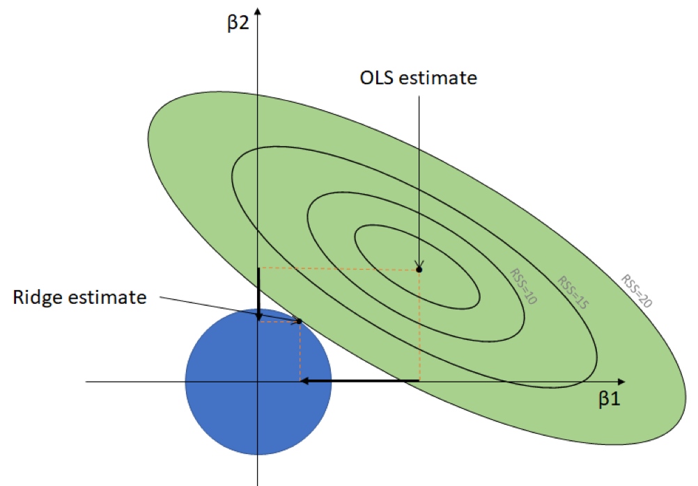

## Packages used in this lecture
```{r message=FALSE}
library(magrittr) # pipes
library(dplyr)    # data manipulation
library(ggplot2)  # plotting
library(GGally)   # ggplot's friend
library(mice)     # boys data
library(mvtnorm)  # multivariate normal fun
library(glmnet)   # penalized regression
library(plotmo)   # informative plots
```


## This session

Goal: learning to apply ridge regression

To reach the goal we need to

1. Refresh our memory
2. Understand how regression works
3. Understand the shortcomings of OLS
4. PLug in the ridge penalty
5. Apply it in software

## So far

At this point we have covered the following models for outcome $Y$ and predictor matrix $X$

__-__ Linear regression 

$$Y=\alpha+\beta X+\varepsilon$$
__-__ Logistic regression

$$Y = \mathbb{E}[Y] + \varepsilon,\quad \text{where}\quad  \mathbb{E}[Y] = \alpha + \beta X$$

 This would enabled us to change $\mathbb{E}[Y]$ such that $f(\mathbb{E}[Y])$ had a linear relation with $X$. 
 <br><br>
 We used the `logit` link function to relate the binary outcome to the linear predictor space. 

## We did not
- formally define it all
- discuss the relation between $X$ and $Y$ under assumed linearity
- discuss how to mathematically regress $X$ on $Y$
- discuss how vector $\beta$ can be obtained, given $Y$ and $X$
- discuss what happens when $X$ does not behave

## Least squares
```{r fig.height=3.7, warning=FALSE, echo=FALSE, message=FALSE, fig.align='center'}
set.seed(123)
plotdata2 <- data.frame(X = rnorm(100, 167.5, 10)) %>%
  mutate(Y = rnorm(100, 0, 10) - X + 335)

fit <- plotdata2 %$%
  lm(Y~X)

 plotdata2 %>%
   mutate(predicted = predict(fit),
          residuals = residuals(fit)) %>%
  ggplot(aes(X, Y)) +
  geom_smooth(method = "lm", se = FALSE, color = "orange") +
  geom_segment(aes(xend = X, yend = predicted), color = "orange", alpha = .5) +
  geom_point(aes(color = abs(residuals))) + 
  scale_color_continuous(low = "blue", high = "red") +  
  guides(color = FALSE) +  
  geom_point(aes(y = predicted), shape = 1, color = "orange") +
  ggtitle("Multivariate (X, Y), higher correlation") +
  theme_minimal()
```

So far we have been focusing on minimizing the squared deviations. This is equivalent to maximizing the likelihood. 

Thus, for regression it holds that OLS = ML

## Notation
Consider an scenario in which $p$ features are measured for $n$ cases. 
<br>
The resulting $(n \times p )$-dimensional data matrix $X$ matrix $X$ is 

$$X = (X_{*, 1} | \dots|X_{*, p}) = 
\begin{bmatrix}
    X_{1, *}\\
    \vdots\\
    X_{n, *}\\
  \end{bmatrix} = 
  \begin{bmatrix}
    X_{1, 1} & \dots & X_{1,p}\\
    \vdots & \ddots & \vdots\\
    X_{n, 1} & \dots & X_{n, p}
  \end{bmatrix}.$$

This matrix is called the *design matrix*. 
```{r echo=FALSE}
set.seed(123)
model.matrix(age ~ hgt + wgt + bmi + hc + reg, data = mice::boys)[sample(1:748, 6), ]
```
This is not the only information that we have. We also have another source of information about the cases and features in $X$: the *response variable* $Y$.

## Aim
The aim is now to explain $Y$ in **terms** of $X$ through the functional relationship

$$Y_i = f(\mathbf{X}_{i, *}), \quad \text{where} \quad i = 1, \dots, n.$$

When we know nothing about the nature of the form of $f(.)$, a reasonable assumption would be to assume that the nature is linear.

*Why is that reasonable?*

When the nature is linear:

<center>
**When $X$ changes, $Y$ also changes with a constant coefficient**
</center>

## The linear model
When $X$ and $Y$ are assumed to be linearly related, then

$$Y_i = \mathbf{X}_{i, *}\boldsymbol{\beta}+\epsilon_i = \beta_1X_{i,1} + \dots + \beta_pX_{i,p} + \varepsilon_i.$$

In the above additive model, the vector $\boldsymbol{\beta} = (\beta_1, \dots, \beta_p)^\prime$ represents the *regression parameter* when regressing $\mathbf{X}$ on $Y$.
<br><br>
The nice thing is that each $\beta_j, j = 1, \dots, p$ denotes the effect size of the $j$th column in $\mathbf{X}$ on the response $Y$. 

  - for each unit change in $X_j$, the realized change in the modeled response $\hat{Y}$ is equal to $\beta$.
 
The term $\varepsilon_i$ represent the part of the response $Y$ that is not explained by the functional model $\beta\mathbf{X}_{i,*}$ and is assumed to be random

  - the functional relation $Y_i = f(\mathbf{X}_{i, *})$ is not assumed to be random
  - the probability distribution of $\varepsilon_i \sim \mathcal{N}(0, \sigma_\varepsilon^2)$
  - all $\varepsilon$ are independent (i.e. $\text{Cov}(\varepsilon_i, \varepsilon_{i^\prime}) = 0$ when $i \neq i^\prime$) 

## Importance of $\varepsilon$
The random nature of $\varepsilon_i$ has a strict implication: because $\varepsilon_i$ is random, $Y_i$ is also a random variable. 

- $Y_i$ is normally distributed because $\varepsilon_i \sim \mathcal{N}(0, \sigma_\varepsilon^2)$ and $\mathbf{X}_{i,*}\mathbf{\beta}$ is a non-random scalar.
- in practice $\mathbf{Y}_i$ may not be exactly normally distributed -> but the above does imply normality for $Y_i$
- without $\varepsilon_i$ all observed $\mathbf{Y}_i$ would need to be exactly on the regression line. 
- without $\varepsilon_i$, our model needs to be perfect

## Moments of $\mathbf{Y}_i$
The expectation for $\mathbf{Y}_i$ equals

$$\mathbb{E}[\mathbf{Y}_i] = \mathbb{E}[\mathbf{X}_{i,*}\mathbf{\beta}] + \mathbb{E}[\varepsilon_i].$$
This is equivalent to 
$$\mathbb{E}[\mathbf{Y}_i] = \mathbf{X}_{i,*}\mathbf{\beta},$$
because $\mathbb{E}[\varepsilon_i] = 0$.

The variance of $\mathbf{Y}_i$ is
$$\begin{align*} \text{Var}[\mathbf{Y_i}] & = \mathbb{E}[(\mathbf{Y}_i - \mathbb{E}[\mathbf{Y}_i])^2]\\
& = \mathbb{E}[(\mathbf{X}_{i,*}\mathbf{\beta})^2 + 2\varepsilon_i\mathbf{X}_{i, *} + \varepsilon_i^2] - (\mathbf{X}_{i,*}\mathbf{\beta}) \\
& = \mathbb{E}[\varepsilon_i^2]\\
& = \sigma_\varepsilon^2.
\end{align*}$$
Hence, $Y_i \sim \mathcal{N}(\mathbf{X}_{i,*}\mathbf{\beta}, \sigma_\varepsilon^2)$.


## Estimating
Remember the linear regression model 
$$Y_i = \mathbf{X}_{i, *}\boldsymbol{\beta}+\epsilon_i = \beta_1X_{i,1} + \dots + \beta_1X_{i,p} + \varepsilon_i.$$

In this model the values for $Y_i$ and $\mathbf{X}_{i, *}$ are known. What remains unknown are the parameters $\mathbf{\beta}$ and $\sigma_\varepsilon^2$.

We know that $Y_i \sim \mathcal{N}(\mathbf{X}_{i,*}\mathbf{\beta}, \sigma_\varepsilon^2)$, so the density is

$$f_{Y_i}(y_i) = (2\pi\sigma_\varepsilon^2)^{-1/2}\text{exp}[-(y_i -\mathbf{X}_{i,*}\mathbf{\beta})^2 / 2\sigma_\varepsilon^2].$$

So far we have expressed everything in terms of the least-squares (i.e. minimizing $\sigma_\varepsilon^2$), but we can also express the linear model in terms of maximizing the likelihood. The likelihood is:

$$L(\mathbf{Y},\mathbf{X};\mathbf{\beta},\sigma_\varepsilon^2) =  \prod_{i=1}^{n} (\sigma_\varepsilon\sqrt{2\pi})^{-1}\text{exp}[\mathbf{Y}_i -\mathbf{X}_{i,*}\mathbf{\beta})^2 / 2\sigma_\varepsilon^2].$$

## The log-likelihood

The maximum of the likelihood coincides with the maximum of the logarithm of the likelihood. In Maximum Likelihood (ML) estimation we therefore aim to maximize the log-likelihood:
$$\mathcal{L}(\mathbf{Y},\mathbf{X};\mathbf{\beta},\sigma_\varepsilon^2) =  \text{log}[\mathbf{Y},\mathbf{X};\mathbf{\beta},\sigma_\varepsilon^2] = -n \text{log}(\sqrt{2\pi\sigma_\varepsilon}) - \frac{1}{2}\sigma_\varepsilon^{-2}\Sigma^n_{i=1}(y_i -\mathbf{X}_{i,*}\mathbf{\beta})^2.$$
By equating $\sigma_\varepsilon^{-2}\Sigma^n_{i=1}(y_i -\mathbf{X}_{i,*}\mathbf{\beta})^2 = (\mathbf{Y} - \mathbf{X}\mathbf{\beta})^\prime(\mathbf{Y} - \mathbf{X}\mathbf{\beta})$ we can find the maximum of the log-likelihood by taking its derivative with respect to $\mathbf{\beta}$:

$$\frac{\partial}{\partial \beta}\mathcal{L}(\mathbf{Y},\mathbf{X};\mathbf{\beta},\sigma_\varepsilon^2) = \frac{1}{2}\sigma_\varepsilon^{-2}\mathbf{X}^\prime(\mathbf{Y}-\mathbf{X}\mathbf{\beta}).$$
Equating this derivative to zero yields

$$\mathbf{X}^\prime\mathbf{X}\mathbf{\beta} = \mathbf{X}^\prime\mathbf{Y},$$
which gives the ML estimator of the regression parameter as:
$$\hat{\beta} = (\mathbf{X}^\prime\mathbf{X})^{-1}\mathbf{X}^\prime\mathbf{Y} \quad \text{with} \quad \text{Var}(\hat\beta) = \sigma^2_\varepsilon (\mathbf{X}^\prime\mathbf{X})^{-1}.$$

## What is the problem?
Everything we have discussed thus far assumed that $(\mathbf{X}^\prime\mathbf{X})^{-1}$ is well-defined. But that is not always the case!
<br><br>
**This means that** 
$$\begin{align}\hat{\beta} & = (\mathbf{X}^\prime\mathbf{X})^{-1}\mathbf{X}^\prime\mathbf{Y}\\ 
\text{Var}(\hat\beta) & = \sigma^2_\varepsilon (\mathbf{X}^\prime\mathbf{X})^{-1},\end{align}$$  
can only be defined when $(\mathbf{X}^\prime\mathbf{X})^{-1}$ exists. 

$(\mathbf{X}^\prime\mathbf{X})^{-1}$ is problematic when

- predictors are highly linearly related. We call this *multicollinearity*
- predictors are fully linearly dependent. We call this *supercollinearity*

## Create some data
```{r fig.height= 3}
set.seed(123) # to allow reproduction
data <- rmvnorm(100, 
                mean = c(50, 100),
                sigma = matrix(c(14, 21, 21, 32), nrow = 2, ncol = 2)) %>% 
  set_colnames(c("X1", "X2")) %>% 
  as_tibble() %>% 
  mutate(epsilon = rnorm(100, mean = 0, sd = 15), 
         Y =  2 * X1 + 4* X2 + epsilon)

var(data)
colMeans(data)
```

## Inspect our data
```{r fig.height=4.5}
data %>% 
  ggpairs() # from GGally
```

## By ourselves
```{r}
Y <- data$Y %>% as.matrix
X <- data %>% select(X1, X2) %>% as.matrix %>% cbind(1, .)
solve(t(X) %*% X) %*% t(X) %*% Y
```
```{r}
Y <- data$Y %>% as.matrix
X <- data %>% select(X1) %>% as.matrix %>% cbind(1, .)
solve(t(X) %*% X) %*% t(X) %*% Y
```

## A linear model
```{r}
data %$% lm(Y ~ X1 + X2) %>% summary
```

## As a generalized linear model
```{r}
data %$% glm(Y ~ X1 + X2, family = gaussian(link = "identity")) %>% summary
```

## Without multicollinearity
```{r}
data %$% lm(Y ~ X1 + X2) %>% summary %>% list(coef = .$coefficients, R2 = .$r.squared) %>% .[-1]
```
```{r}
data %$% lm(Y ~ X1) %>% summary %>% list(coef = .$coefficients, R2 = .$r.squared) %>% .[-1]
```

## Supercollinearity
```{r}
mammalsleep %>% select(sws, ps, ts) %>% 
  tail()
```

For predictors `sws`, `ps` and `ts`, the crossproduct $\mathbf{X}^\prime\mathbf{X}$ is singular
```{r error=TRUE}
X <- mammalsleep %>% select(sws, ps, ts) %>% na.omit() %>% as.matrix()
solve(t(X) %*% X)
```

## Singularity
If we remove the third column, the linear dependency is gone and all is well. 
```{r}
solve(t(X[, -3]) %*% X[, -3])
```

- A square matrix with no inverse we call singular
- A matrix $\mathbf{M}$ is said to be singular if its determinant $\text{det}(\mathbf{M}) = 0$
- The determinant is the product  of the eigenvalues 
```{r error=TRUE}
matrix(c(2, 3, 5, 7.5), 2, 2) %>% solve()
matrix(c(2, 3, 5, 7.5), 2, 2) %>% eigen() %>% .$values
```

## So?
Multicollinearity and supercollinearity may impact any data set. <br>
Supercollinearity will occur in high-dimensional data, especially when $n\ll p$.
<br><br>
In general; the more columns you are introducing to the estimation procedure, the higher the likelihood that something may impact the estimation. 
<br><br>
**Why would we avoid this?**

- If paramater estimates cannot be trusted, then model selection becomes challenging
- If the assumptions of the (linear) model are not met, then estimation becomes unreliable
- If $(\mathbf{X}^\prime\mathbf{X})^{-1}$ does not exist, then it all falls apart. 

**Solution**<br>
*Mess up* $(\mathbf{X}^\prime\mathbf{X})^{-1}$ such that it exists. 

# Ridge regression

## How it works
Because the least squares estimator 
$$\hat{\beta} = (\mathbf{X}^\prime\mathbf{X})^{-1}\mathbf{X}^\prime\mathbf{Y},$$
is not defined, we add a small *ridge parameter* to avoid the problem:
$$\hat{\beta} = (\mathbf{X}^\prime\mathbf{X} + \lambda\mathbf{I_{pp}})^{-1}\mathbf{X}^\prime\mathbf{Y}$$

Remember the simulated data:
```{r}
Y <- data$Y %>% as.matrix
X <- data %>% select(X1, X2) %>% as.matrix %>% cbind(1, .)
```

## Estimating $\hat\beta$
$$\hat{\beta} = (\mathbf{X}^\prime\mathbf{X} + \lambda\mathbf{I_{pp}})^{-1}\mathbf{X}^\prime\mathbf{Y}$$

When $\lambda = 0$, the result is simple and all three methods yield the same result
```{r}
lm(Y ~ X1 + X2, data = data) %>% coef
glmnet(x=X[,-1], y=Y, family = gaussian, alpha = 0, lambda = 0, thresh=1e-17) %>% coef %>% t()
MASS::lm.ridge(Y ~ X1 + X2, data = data, lambda = 0)
```

## Estimating $\hat\beta$
$$\hat{\beta} = (\mathbf{X}^\prime\mathbf{X} + \lambda\mathbf{I_{pp}})^{-1}\mathbf{X}^\prime\mathbf{Y}$$

When $\lambda = 1$, the results are different
```{r}
lm(Y ~ X1 + X2, data = data) %>% coef
glmnet(x=X[,-1], y=Y, family = gaussian, alpha = 0, lambda = 1) %>% coef %>% t()
```

## Why are results different?
The results differ because of the regularization. 

- The total residual sum of squares is still minnimized in ridge regression
- However, with $\lambda$ we aim to shrink the estimates towards zero
- You can see it as keeping the sum of squares of the coefficient below a certain value. $\lambda$ governs which value. 

With $\lambda = 0$, shrinkage is absent and ridge regression yields the same solution as least-squares estimation. But if $\lambda \to \infty$, the effect of shrinkage becomes much more prominent and the ridge parameters will move to zero. 
<br><br>
**Different $\lambda$** will thus produce different estimates. 
<br><br><br>

## Penalization visualized
<center>
{width=70%}
</center>
image from [Bruce Hansen](https://www.ssc.wisc.edu/~bhansen/crete2019/BruceHansenLecture5.pdf)

## How to choose $\lambda$
```{r}
fit <- cv.glmnet(X, Y, alpha = 0, nfolds = 5)
fit
fit %>% coef(s = c(2.399, 12.804))
```

## Visual inspection
```{r fig.height=4}
plot(fit)
```

## Visual inspection
```{r fig.height=4}
glmnet(X, Y, alpha = 0) %>% plot_glmnet(s = fit$lambda.min) # from plotmo
```

## Last comments

Historically, ridge regression has been developed to 

1. solve multicollinearity
2. solve singularity
3. stabilize the estimator

More recently, in contemporary data science it is mainly aimed at

__a__ penalizing least squares
__b__ regularizing least squares


