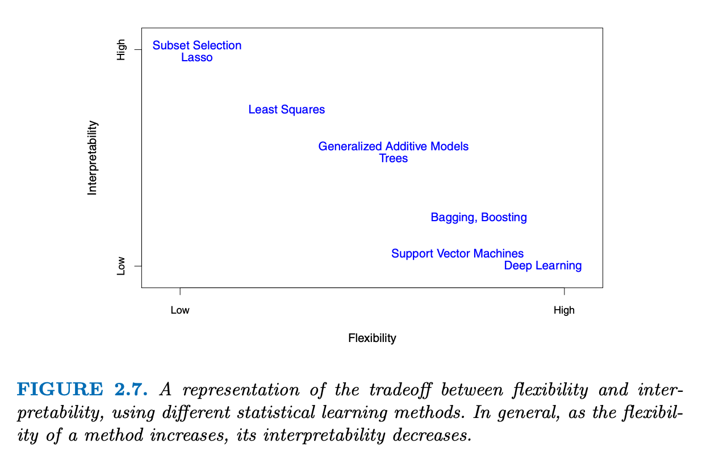

## Packages used in this lecture
```{r message=FALSE}
library(MASS)     # randomization functions
library(magrittr) # pipes
library(dplyr)    # data manipulation
library(ggplot2)  # plotting
library(glmnet)   # penalized regression
library(VariableScreening)   # high-dimensional data
library(caret)    # flexible machine learning
library(plotmo)   # informative plots
library(coefplot) # coef stuff
library(DT)       # fancy tables
```

## So far 
We have learned about ridge regression
<br><br>
Ridge regression poses - next to the usual minimization of the sum of squared deviations - a restriction on the sum of the coefficients. 

- The more restricted the sum of coefficients is, the more the coefficients must shrink to zero. 
- The least restrictive the penalization is, the more the solution resembles least squares estimation. 
- The ridge penalty shrinks the coefficients of correlated predictors towards each other. This is not necessarily what you would want.


It is not difficult to understand that the more you shrink the coefficients, the more bias you will induce. However, with the higher bias comes less variance. 
<br><br>
Hence, we are back at the bias variance tradeoff

## Bias variance tradeoff
**The bias-variance tradeoff** is the property of a model that the variance of the parameter estimated across samples can be reduced by increasing the bias in the estimated parameters.

<center>
{width=50%}
<br>[image source](https://en.wikipedia.org/wiki/File:Bias_and_variance_contributing_to_total_error.svg)
</center>
<br><br>
It seems counterintuitive to induce bias - however, the MSE is composed of bias, variance and irreducible error. Optimizing for the bias and variance makes sense and yields better performance. 

## Bias variance tradeoff
<center>
{width=90%}
<br>[image source](https://miro.medium.com/max/1400/1*9hPX9pAO3jqLrzt0IE3JzA.png)
</center>
<br><br>
Regularization methods (i.e. ridge and lasso) introduce bias in the solution that can reduce the variance considerably when compared to e.g. least squares. 
<br><br>
Least squares is unbiased: the regression coefficients are without bias. 
<br><br>
Yet, the lower variance solution obtained with regularized techniques provides superior performance. At least with respect to the Mean Squared Error. 

## The curse of dimensionality
```{r echo = FALSE}
y <- c(1, .8, 1.1); x <- c(0.5, .3, .8)
cbind(y, x)
```
<center>

</center>
[image from uudav slides](https://uudav.nl/lectures/01_high_dimensional/lecture_01.pdf)

## The curse of dimensionality
```{r echo = FALSE}
y <- c(1, 1.1); x <- c(0.5, .8)
cbind(y, x)
```
<center>

</center>
[image from uudav slides](https://uudav.nl/lectures/01_high_dimensional/lecture_01.pdf)

## The curse of dimensionality
```{r echo = FALSE}
y <- c(1); x <- c(0.5)
cbind(y, x)
```
<center>

</center>
[image from uudav slides](https://uudav.nl/lectures/01_high_dimensional/lecture_01.pdf)


## So why did ridge work so well?

The ordinary least squares (OLS) solution has low bias and low variance if the response and the predictors are linear in scenarios where there are a large number of observations and everything is well-defined.

If everything is not well-defined, then adding a little more bias will lower the variance and yield a much more efficient MSE.

If the number of cases is much smaller than the number of features (predictors), then the ridge regression will yield far better results: 

- the variance of the OLS is then unbiased, but the variance are large. Predictions will then be far away from the actual values. 
- ridge regression can reduce this variance without a substantial increase in bias. 

An optimal shrinkage parameter needs to be chosen. 

## What can ridge not do?
1. Ridge regression cannot do magic
2. Ridge regression cannot think by itself
3. Ridge regression cannot determine if some coefficients should be shrunk more than others
4. Ridge regression cannot select the most efficient set of features


But Lasso regression can pose an answer to (3) and (4)

# Lasso regression

## Lasso
**Lasso** stands for Least Absolute Shrinkage and Selection Operator. 

Lasso differs from ridge in two aspects:

__1__ The lasso uses the $L^1$-norm, also known as the Manhattan norm. The $L_1$-norm is simply the sum of the absolute values of the coefficients.

  - This differs from the ridge regression, which uses the squared $L_2$, or Euclidian norm. The $L_2$-norm defines the distance as the straight line between two points in a space. 
  
__2__ Because the Lasso poses a restriction on the sum of the absolute coefficients, some coefficients can be set to zero. 

  - This differs from ridge regression where the shrinkage is applied on all coefficients: the large ones and the small ones. 
  
The goal of Lasso regression is to obtain the subset of predictors that minimizes prediction error. 

## How does this work
**Shrinkage:** The Lasso poses a constraint on the model parameters that causes regression coefficients for some variables to shrink toward zero. 

- features with coefficients equal to zero after the shrinkage process are excluded from the model. 

**Selection:** The most important features are identified.

- features with non-zero coefficients are most strongly associated with the response variable. 

## Penalty functions
With ridge regression we had the penalty
$$\lambda \cdot \sum_{j=1}^p\beta_j^2 = \lambda \cdot ||\beta||_2^2.$$
With the Lasso we have the penalty
$$\lambda \cdot \sum_{j=1}^p|\beta_j| = \lambda \cdot ||\beta||_1$$


## Lasso vs Ridge: in 2 dimensions
<center>
{width=70%}
</center><br>
image from [ISLR V2](https://web.stanford.edu/~hastie/ISLR2/ISLRv2_website.pdf)

## Why use Lasso regression?

**Greater prediction accuracy:** If there are many more features than cases, the variance of the OLS parameters will be higher. 
<br><br>
In such cases, the Lasso can reduce variance without substantially increasing the bias. 
<br><br>
**Improved model interpretability:** When not all features are really associated with the  response variable, we end up with an overfitted model that may be difficult to interpret. 
<br><br>
With Lasso regression the coefficients for unimportant features are reduced to zero

- this effectively removes the contribution of these features from the model
- the resulting model is more parsimonious

The question is what value of $\lambda$ would still allow for an efficient and interpretable model. 

## Create some data
```{r fig.height= 3}
set.seed(123)
data <- simulateVCM(n = 200, p = 2000) 
dim(data$X)
idx <- createDataPartition(data$Y, p = .7, list = FALSE)
train <- cbind(data$Y, data$X)[idx, ]
test <- cbind(data$Y, data$X)[-idx, ]
colnames(train) <- colnames(test) <- c("Y", paste("X", 1:2000, sep = ""))
```

## Ridge
```{r}
fit.ridge <- cv.glmnet(x = train[, -1], y = train[, 1], alpha = 0, nfolds = 10)
plot(fit.ridge)
```

## Ridge
```{r}
fit.ridge
```


## Lasso
```{r}
fit.lasso <- cv.glmnet(x = train[, -1], y = train[, 1], alpha = 1, nfolds = 10)
plot(fit.lasso)
```

## Lasso
```{r}
fit.lasso
```

## Visualize
```{r}
glmnet(x = train[, -1], y = train[, 1], alpha = 1) %>% plot_glmnet(s = fit.lasso$lambda.min)
```

## Coefs
```{r}
extract.coef(fit.lasso, s = 'lambda.min') %>% datatable()
```

## Coefficients
```{r warning=FALSE, message=FALSE}
coefplot(fit.lasso)
```


## Performance
```{r warning=FALSE}
OLS <- lm(train[, 1] ~ train[, -1]) %>% predict(newdata = data.frame(test[, -1]))
ridge <- fit.ridge %>% predict(newx = test[, -1], s = "lambda.min")
lasso <- fit.lasso %>% predict(newx = test[, -1], s = "lambda.min")

caret::postResample(OLS, test[, 1])
caret::postResample(ridge, test[, 1])
caret::postResample(lasso, test[, 1])
```

## With Caret
```{r cache = TRUE}
lambda.grid <- seq(0, .5, by = .01)
lasso <- train(train[, -1], train[, 1], 
               data = train, 
               method = "glmnet",
               metric = "RMSE",
               trControl = trainControl("cv", number = 10),
               tuneGrid = expand.grid(alpha = 1, lambda = lambda.grid))
```

## Why does `caret` yield another $\lambda$?
```{r fig.height=3.5}
plot(lasso)
lasso$bestTune$lambda
```

## So far

**The curse of dimensionality** poses restrictions on what we can do. There are some fixes:

__1__ Feature selection

  - Filtering: dropping features because of low variance | low correlation with the response | any other reason?
  - Wrapper: Fitting different models and compare them. For example, forward/backwards selection, AIC, etc.
    - Wrapper techniques are computationally intensive. 

__2__ Penalization / regularization / shrinkage

  - Constrain the modeling coefficients
  - Aim to set some modeling coefficients to zero
  
__3__ *Dimension reduction* where the aim is to summarize $p$ features in $q<p$ features

## Interpretability vs Flexibility
<center>
{width=70%}
</center>
image from [ISLR V2](https://web.stanford.edu/~hastie/ISLR2/ISLRv2_website.pdf)

## Pro's and Con's

**Ridge and Lasso are aimed at prediction - not inference**
<br><br>
Inference is best done by means of maximum likelihood - because its parameter estimates are unbiased. 
<br><br>
That said, both Ridge and Lasso regression push coefficients towards zero

  - the aim is to make them work better on new data (prediction)
  - shrinkage allows for more complex models and avoids overfitting

In scenarios where many features together explain a response variable - **ridge regression** is the most optimal as its regularization strength does not discriminate over parameters. If the underlying mechanism is sparse, **lasso regression** is more fitting and can recover the sparse process. 

But what if you want both?

# Elastic net
<style>
.forceBreak { -webkit-column-break-after: always; break-after: column; }
</style> 

## Elastic net regularization {.columns-2 .smaller}
**The elastic net** combines the $L_2$ regularization of ridge regression with the $L_1$ regularization properties of the Lasso

- $L_2$ defines the regularization stength
- $L_1$ defines the sparseness of the obtained results

<p class="forceBreak"></p>

<center>
{width=100%}
</center>
[image source](https://html.scirp.org/file/15-1501683x23.png)

## Fiting an elastic net
```{r warning=FALSE}
elastic <- train(train[, -1], train[, 1], 
               data = train, 
               method = "glmnet",
               metric = "RMSE",
               trControl = trainControl("cv", number = 10),
               tuneLength = 10)
```

## Visualize
```{r fig.height=4.5}
plot(elastic)
```

## Coefs
```{r}
elastic
```

## Performance
The model with the lowest RMSE:
```{r}
elastic$bestTune
```

When looking at performance:
```{r}
pred <- elastic %>% predict(test[, -1])
postResample(pred, test[, 1])
```

With the elastic net we have to optimize over two hyperparamaters.
