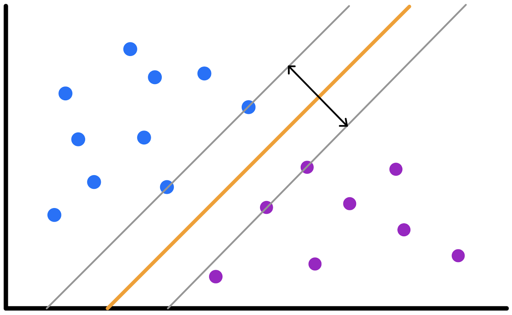

## Packages used in this lecture
```{r message=FALSE}
library(MASS)     # for the cats data
library(magrittr) # pipes
library(dplyr)    # data manipulation
library(caret)    # flexible machine learning
library(e1071)    # for SVM's
library(DT)       # interactive tables
set.seed(123)     # for reproducibility
```

## So far 

We have learned the following techniques

- linear regression
- logistic regression
- ridge regression
- lasso regression
- the elastic net

## Data

<center>
{width=80%}
</center>
<br><br>
Our data has two classifications that are perfectly seperable by a hyperplane

## Hyperplanes
A hyperplane is a subspace whose dimension is one less than that of its ambient space.
<br><br>
Hyperplanes divide a $p$-dimensional space into two distinct parts
<br><br>
<center>
{width=40%}
</center>
[image source](https://miro.medium.com/max/600/0*iDZMC0LsciIANcYv.gif)

## For our data
<center>
{width=80%}
</center>
The aim for this lecture is to find the hyperplane that seperates the space into two parts. 
<br><br>
We will explore multiple ways of doing so

## But there is a problem
<center>
{width=80%}
</center>
When data are perfectly seperable, there are infinite hyperplanes that seperate the space

## Maximal Margin Classifier
<center>
{width=80%}
</center>
The chosen hyperplane maximizes the margins (i.e. the perpendicular distance from the hyperplane)
<br><br>
The observations that fall on the margins are called the *support vectors*

## Maximal Margin Classifier
<center>
{width=80%}
</center>
The maximal margin classifier suffers from a problem: it is highly dependent on the support vectors. 
<br><br>
Shifting, removing or adding even a single observation may lead to a dramatic change in the maximal margin hyperplane. 

## Inseperable classes
<center>
{width=80%}
</center>
The maximal margin classifier is not suitable when classes are not perfectly seperable by a straight line
<br><br>
In that case some room for error (Cost) needs to be allowed

## So far

**The maximal margin classifier** creates a hyperplane that maximizes the margins towards the support vectors

- It works if and only if classes are perfectly seperable
- It is highly sensitive to individual observations
- It is a so-called **hard classifier**

## Support vector classifier
<center>
{width=80%}
</center>
With the support vector classifier we allow for two errors: Observations may be incorrectly classified and observations may be on the wrong side of the margin. 

## How does it work?
Instead of minimizing the margins, we specify a total amount of *error* to be allowed. 
<br><br>
To allow for individual to be on the wrong side of both the hyperplane and the margin, we define **slack variables** $\varepsilon_i$.

- When $\varepsilon_i = 0$ then the $i$th observation is on the correct side of the margin.
- When $\varepsilon_i > 0$ then the $i$th observation is on the wrong side of the margin.
- When $\varepsilon_i > 1$ then the $i$th observation is on the correct side of the hyperplane.

You can imagine that the wider we choose the margins, the higher the sum of the $\varepsilon_i$'s. 
<br><br>
To bound the sum of the $\varepsilon_i$'s we need a tuning parameter $C$. 

- $C$ determines the number and severity of the violations to the margin (and to the hyperplane) that we will tolerate.
- If there is no room for violations to the margin, then it must be the case that $\varepsilon_1 = \dots = \varepsilon_n = 0$. In that case $C$ is large.

## Choosing $C$

$C$ is a tuning parameter and needs to be chosen. 

- When $C$ is small, margins will be wide. With wider margins come many support vectors and more misclassified observations. 
- When $C$ is large , margins will be narrow. With narrower margins come fewer support vectors and less misclassified values.

Just like with every technique so far it holds that lowering $C$ may prevent overfitting. This may yield better performance on the test set.
<br><br>
We can again use validation techniques to find the value for $C$ for which we minimize test error. 
<br><br><br><br>
[A good demo to play around with](https://cs.stanford.edu/~karpathy/svmjs/demo/) 

## Non-linear seperability
<center>
{width=80%}
</center>
The support vector classifier is a linear classifier: It can not classify non-linearly seperable data. 

## So far

**The maximal margin classifier** creates a hyperplane that maximizes the margins towards the support vectors

- It works if and only if classes are perfectly seperable
- It is highly sensitive to individual observations
- It is a so-called **hard classifier**

**The maximal margin classifier** creates a hyperplane that maximizes the margins towards the support vectors

- It works if and only if classes are linearly seperable
- It is not sensitive to individual observations
- It is a so-called **soft classifier**
- Use $C$ to optimize for the margins: the distance the decision boundaries have from the hyperplane. 

## Support vector machine
The **support vector machine** extends the support vectors classifier by using *kernels* to create non-linear decision boundaries. 

Through the *kernel trick* it is possible to map the inputs in the original (i.e. lower dimensional space) and returns the dot product of the transformed vectors in the higher dimensional space. 

It uses a *kernel function*. The most used are:

- linear kernel
- polynomial kernel
- radial kernel

If you want to read more about kernels, [this link](https://towardsdatascience.com/the-kernel-trick-c98cdbcaeb3f) provides some nice easy explanation

## Linear kernel
<center>
{width=80%}
</center>

## Polynomial kernel
<center>
{width=80%}
</center>

With the polynomial kernel we need to optimize over the polynomial degree, $C$ and the scale (variance) $\gamma$. 


## Radial basis function kernel
<center>
{width=80%}
</center>


With the radial kernel there is another optimizable parameter $\gamma$. 
<br><br>

## Optimal $\gamma$
We can view $\gamma$ as the inverse of the radius of influence of samples that are selected by the model as support vectors.

- the RBF kernel uses a Gaussian function
- low $\gamma$ defines a Gaussian function with high variance: similarity is easier to realize between two points
- High $\gamma$ defines a Gaussian function with low variance: similarity is harder to realize between two points - points need to have actual proximity.

Like always, $\gamma$ can be optimized by test/train validation. 

## Simple example
```{r}
head(cats)
svm.cats <- svm(Sex ~ ., data = cats, kernel = "linear", cost = 1, scale = TRUE)
```

## Output
```{r}
svm.cats
```

## Plot
```{r fig.height=4}
plot(svm.cats, cats)
```

## Plot
```{r fig.height=4}
svm.cats <- svm(Sex ~ ., data = cats, kernel = "linear", cost = 4, scale = TRUE)
plot(svm.cats, cats)
```

## with `caret` and crossvalidation
```{r}
train_control <- trainControl(method="repeatedcv", number=10, repeats=3)
svm.cats <- train(Sex ~., 
                  data = cats, 
                  method = "svmLinear", 
                  trControl = train_control,  
                  preProcess = c("center","scale"))
```

## Output from caret
```{r}
svm.cats
```
Parameter $C$ is kept constant by default.

## Optimizing for $C$
```{r linear_kernel, cache = TRUE}
svm.cats <- train(Sex ~., 
                  data = cats, 
                  method = "svmLinear", 
                  trControl = trainControl(method="repeatedcv", number=10, repeats=3),  
                  preProcess = c("center","scale"),
                  tuneGrid = expand.grid(C = seq(0.1, 10, length = 50)))
```

## Optimal C
```{r fig.height=4}
plot(svm.cats)
```

## Plot
```{r fig.height=4}
kernlab::plot(svm.cats$finalModel)
```

## Radial Kernel
```{r radial_kernel, cache = TRUE}
svm.cats <- train(Sex ~., 
                  data = cats, 
                  method = "svmRadial", 
                  trControl = trainControl(method="repeatedcv", number=10, repeats=3),  
                  preProcess = c("center","scale"),
                  tuneGrid = expand.grid(C = seq(0.1, 5, by = .1),
                                         sigma = seq(0.5, 5, by = .5)))
```
```{r echo=FALSE}
datatable(svm.cats$results, options = list(pageLength = 5, lengthMenu = c(5, 10, 15, 20)))
```


## Optimal C and $\gamma$
```{r fig.height=3}
plot(svm.cats)
svm.cats$bestTune
```

## Plot
```{r fig.height=4}
kernlab::plot(svm.cats$finalModel)
```

## Performance
```{r}
pred <- predict(svm.cats)
postResample(pred, cats$Sex)
confusionMatrix(pred, cats$Sex)$table
```
