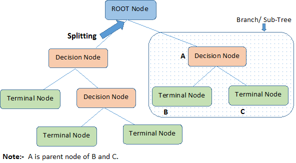

## Packages used in this lecture
```{r message=FALSE, warning=FALSE}
library(magrittr) # pipes
library(dplyr)    # data manipulation
library(caret)    # flexible machine learning
library(DT)       # interactive tables
library(readr)    # reading in csv
library(rpart)    # trees
library(rpart.plot) # plotting trees
set.seed(123)     # for reproducibility
```

```{r}
con <- url("https://www.gerkovink.com/erasmus/Day%202/Part%20D/titanic.csv")
titanic <- read_csv(con, show_col_types = FALSE)
```

## So far 

We have learned the following techniques

- linear regression
- logistic regression
- ridge regression
- lasso regression
- the elastic net
- support vector machines

## Trees

<center>
{width=70%}
</center>

[image source](https://www.researchgate.net/figure/Image-to-explain-Decision-Tree-Algorithm_fig6_342611294)

## Decision trees

Decision trees form a collection of learning algorithms that can be applied to regression and classification problems. 

- The algorithms are called trees because it follows a *tree-like* structure  

A decision tree is a series of nodes, a directional graph that starts at the base with a single node and extends to the many leaf nodes that represent the categories or subdivisions of the parameter space that the tree can classify. 
<br><br>
Another way to think of a decision tree is as a flow chart, where the flow starts at the root node and ends with a decision made at the leaves. 
<br><br>
Splits are based on the predictor space. When a split is ignored or discarded, we call it **pruning**.
<br><br>
All nodes other than the root node have *parent nodes*. 


## Nodes explained
<center>
{width=80%}
</center>
[image source](https://wiki.pathmind.com/images/wiki/decision_tree_nodes.png)

## Classification and regression trees
<center>
{width=80%}
</center>
[image source](https://wiki.pathmind.com/images/wiki/decision_tree_nodes.png)

## Popularity
Decision trees are very popular. This popularity is due to:
<br><br>
**Exploratory benefits**: through decision trees we can identify important features and important interactions between features. 

  - This may allow to separate the signal from the noise. 

**Explanatory power**: it is often straigthforward to interpret decision trees when you have limited statistical expertise. 
<br><br>
**Robust**: a decision tree is a non-parametric algorithm. It therefore does not pose any restrictions and/or assumptions on the parameter space and the relation between the predictors and the response.
<br><br>
**Generic**: a decision tree can make classifications no matter the measurement level of the predictors.
<br><br>
**time-saving**: decision trees require less data editing than other methods, because they are insensitive to skewness, outliers, unobserved cells, etc. 

-  trees do not solve the missingness in your data, they simply *grow* around it.

## However
Classification and regression trees also have disadvantages:
<br><br>
**Overfitting**: Fitting a tree to the degree where it is tailored to your data may yield low training bias, but high test error. 

- putting constraints on the depth (or height) of the tree may help
- pruning is another way to regularize a tree. By not using every branch, more bias is induced. 

**Discretization**: For continuous responses, trees may be less efficient.P

- predictions must be separated into discrete categories, which results in a loss of information when applying the model to continuous values.

**Feature engineering**: Trees require the predictor space to be well-selected and defined. 

## That said
<center>
{width=80%}
</center>
[image source](https://wiki.pathmind.com/images/wiki/decision_tree_nodes.png)

## Fitting a tree
```{r}
titanic %<>% 
  mutate(Pclass = factor(Pclass, labels = c("1st class", "2nd class", "3rd class")), 
         Survived = factor(Survived, labels = c("Died", "Survived")))
idx <- createDataPartition(titanic$Survived, p = .8, list = FALSE)
train <- titanic[idx, ]
test <- titanic[-idx, ]
tree <- rpart(Survived ~ Age + Pclass + Sex, data = train, method = "class")
```

## inspecting a tree
```{r fig.height=4}
rpart.plot(tree)
```

## Pruning a tree?
```{r fig.height=3.7}
prune(tree, cp = .02) %>% rpart.plot()
```
In order to prune a tree we need to select a complexity parameter `cp`: the minimum improvement in the model needed at each node.

## Choosing `cp`
```{r choosing_cp, cache=TRUE}
tree <- train(Survived ~ Age + Pclass + Sex, 
              data = titanic, 
              method = "rpart",
              tuneGrid = expand.grid(cp = seq(0.001, 1, by = .001)))
```

## Complexity parameter
Too low `cp` will overfit. Too high `cp` will underfit.
```{r tree_optimized, fig.height=3, cache=TRUE}
plot(tree)
tree$bestTune
```

## Output
```{r}
tree
```


## Bootstap aggregating
<center>
{width=100%}
</center>
<br>
<center>
{width=60%}
</center>
[image source](https://en.wikipedia.org/wiki/Bootstrap_aggregating#/media/File:Ensemble_Bagging.svg)

## Bootstap aggregating
Aggregating trees over bootstrap samples has some avantages:

1. Aggregated weak learners typically outperform a single learner over the entire set. The ensemble has less overfit.
2. Aggregating removes variance in high-variance low-bias weak learner scenarios.
3. Aggregation can be paralellized.
4. Out-of-Bag cases can be used for validation. 

Aggregating also has disadvanteges

1. Lots of aggregations are computationally costly, especially for larger data sets. 
2. Interpretability of the ensemble may be lost
3. Which features are important if their contribution is averaged?
4. Weak learners with high bias will still have high bias in the bagging, yielding high Out-of-Bag performance.

## Variable importance
```{r}
varImp(tree)
```

## Variable importance
```{r fig.height=4}
varImp(tree) %>% plot
```

## Bagging
```{r bagging, cache = TRUE}
tr.ctrl <- trainControl(method = "cv", number = 10, savePredictions = TRUE)
bag <- train(Survived ~ Age + Pclass + Sex, 
             data = titanic, 
             method = "treebag",
             trControl = tr.ctrl,
             nbagg = 200,  
             control = rpart.control(minsplit = 10, minbucket = 3, cp = 0.003))
```

- **minsplit**: the minimum number of observations that must exist in a node in order for a split to be attempted.
- **minbucket**: the minimum number of observations in any terminal leaf node.


## Bagging result
```{r}
bag
```
## Bagging variable importance
```{r bag_varimp, cache = TRUE, fig.height=4}
varImp(bag) %>% plot
```
However: in the bagging approach, the trees are correlated because the same predictors are used every time. 

## Random forests
With Random Forest, the predictor space is limited for each tree: only a subset $m$ of predictors $p$ is chosen. 

  - **with bagging** only the best predictors end up in every tree
    - trees are correlated
    - variance is high
  - with random forests every predictor has a fair chance
    - trees are decorrelated
    - variance is low
    
```{r forest, cache=TRUE}
rf <- train(Survived ~ Age + Pclass + Sex, 
            data = titanic, 
            method = "rf", 
            trControl = tr.ctrl)
```

## Optimizing $m<p$ predictors `mtry`
```{r}
rf
```

## RF Importance
```{r fig.height=4}
varImp(rf) %>% plot
```

## Boosting
<center>
{width=100%}
</center>
<br>
<center>
{width=60%}
</center>
[image source](https://en.wikipedia.org/wiki/Boosting_(machine_learning)#/media/File:Ensemble_Boosting.svg)

## Boosting
```{r boost, cache=TRUE}
boost <- train(Survived ~ Age + Pclass + Sex, 
               data = titanic, 
               method = "adaboost", 
               trControl = tr.ctrl)
```
- Apply a weak classifier (e.g. stump) to training data; 
- Increase the weights for incorrect classifications, and repeat;
- The ensemble classifier is a linear combination of the weak classifiers.

## Boosting
```{r}
boost
```

## Boosting importance
```{r fig.height=4}
plot(boost)
```

## ROC
```{r}
library(MLeval)
metrics <- evalm(boost)
```
## ROC
```{r}
metrics$roc
```

## Disclaimer
I have introduced you to the core machine learning techniques in R. 
<br><br>
These techniques come together in the `caret` package. 
<br><br><br><br><br><br>
**See [the `caret` documentation](https://topepo.github.io/caret/index.html) for all techniques that can be trained with `caret`**
<br><br><br><br><br><br>
If you have any questions in the future, drop me a line. 