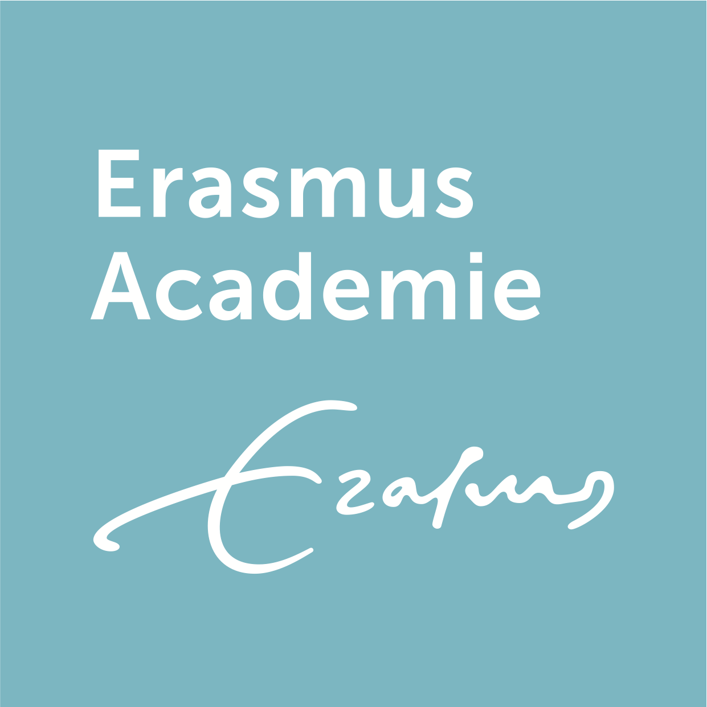

# Intro {.sidebar}

This dashboard covers the course materials for the course [**Data Science and Predictive Machine Learning**](https://www.eur.nl/erasmusacademie/cursus/opleiding-data-science-predictive-machine-learning). 
<br> <br>

---

<center>
<a href='https://www.eur.nl/erasmusacademie/cursus/opleiding-data-science-predictive-machine-learning'></a>
</center>

---

Course leader: [Gerko Vink](https://www.gerkovink.com) <br>

---

I usually adapt the course as we go, so I suggest to access the materials online when we consider them. 

---
# Quick Overview

## Column 1

### Outline
Veel data zijn complex en gevarieerd. Door de juiste analysemethoden te gebruiken kan de impact die dat heeft op processen en wetenschap worden vergroot. In een hedendaagse data science workflow worden machine learning methoden steeds vaker ingezet om de waarde van big data te benutten. Tijdens de opleiding Data Science & Predictive Machine Learning leer je de laatste ontwikkelingen op het terrein van voorspellen, modelleren en analyse en leer je hoe je de informatie uit data op waarde kunt schatten. Je gaat de theorie zelf toepassen in het programma R. 

Meer informatie en details zijn te vinden op [deze cursus pagina](https://www.eur.nl/erasmusacademie/cursus/opleiding-data-science-predictive-machine-learning)

### Locatie
Alle cursusdagen zijn in het gebouw van de [VNAB](https://www.google.com/maps/place/VNAB+knowledge+and+meeting/@51.91467,4.4871983,15z/data=!4m5!3m4!1s0x0:0xb3604a5c4a4bc363!8m2!3d51.91467!4d4.4871983). Een online live stream is beschikbaar voor alle deelnemers binnen de MS Teams omgeving van de cursus. 


## Column 2

### Dagschema 

| When?  |      | What?      |
|:--------|:-------|:-------------|
| 09.30 | 10.15  | Lecture |
| 10:15 | 11.00  | Practical |
| 11.00 | 11.30  | Discussion |
|       | **break** |            |
| 11.45 | 12.30  | Lecture |
|       | Lunch |            |
| 13:30 | 14.15  | Practical |
| 14:15 | 14.45  | Discussion |
|       | **break** |            |
| 15:00 | 15:45 | Lecture |
| 15:45 | 16.30  | Practical |
| 16:30 | 17:00  | Discussion |

# How to prepare

## Column 1

### Preparing your machine for the course
Dear all, 

To realize a steeper learning curve, we will use some functionality that is not part of the base installation for `R`. The below steps guide you through installing both `R` as well as the necessary additions. 

I look forward to see you all in Rotterdam. 

*Gerko*

### **System requirements**

Bring a laptop computer to the course and make sure that you have full write access and administrator rights to the machine. We will explore programming and compiling in this course. This means that you need full access to your machine. Some corporate laptops come with limited access for their users, we therefore advice you to bring a personal laptop computer, if you have one. 

### **1. Install the latest version of `R`**
`R` can be obtained [here](https://cran.r-project.org). We won't use `R` directly in the course, but rather call `R` through `RStudio`. Therefore it needs to be installed. 

### **2. Install the latest `RStudio` Desktop**

Rstudio is an Integrated Development Environment (IDE). It can be obtained as stand-alone software [here](https://www.rstudio.com/products/rstudio/download/#download). The free and open source `RStudio Desktop` version is sufficient.

### **3. Start RStudio and install the following packages. **

Execute the following lines of code in the console window:

```{r eval=FALSE, echo = TRUE}
install.packages(c("ggplot2", "tidyverse", "magrittr", "knitr", "rmarkdown", 
                   "plotly", "ggplot2", "shiny", "devtools", "boot", "class", 
                   "car", "MASS", "ggplot2movies", "ISLR", "DAAG", "mice", 
                   "purrr", "furrr", "future", "rpart", "ranger", "xgboost", 
                   "caret"), dependencies = TRUE)
```


If you are not sure where to execute code, use the following figure to identify the console - ignore the outdated version in the example:

<center>
  
</center>

Just copy and paste the installation command and press the return key. When asked 

```{r eval = FALSE, echo = TRUE}
Do you want to install from sources the package which needs 
compilation? (Yes/no/cancel)
```

type `Yes` in the console and press the return key. 

## Column 2

### **What if the steps to the left do not work for me?**
If all fails and you have insufficient rights to your machine, the following web-based service will offer a solution. 

- Open a free account on [rstudio.cloud](https://rstudio.cloud). You can run your own cloud-based `RStudio` environment there. 

Naturally, you will need internet access for these services to be accessed. Wireless internet access will be available at the course location. 


# Dag 1

## Column 1

### Materials
Ik pas mijn onderwijs meestal aan de doelgroep aan. Daardoor kunnen onderwijsmaterialen soms zelfs gedurende de dag veranderen of uitgebreid worden. Om er zeker van te zijn dat je de laatste iteratie van de cursusmaterialen hebt, adviseer ik om de materialen online te bekijken. 

- Part A: Introduction
    - [Lecture A](Day 1/Part A/Lecture-A.html)
    - [Practical A](Day 1/Part A/Practical_A_walkthrough.html)
- Part B: Estimation, testing and prediction 
    - [Lecture B](Day 1/Part B/Lecture_B.html)
    - [Practical B](Day 1/Part B/Exercise_B.html)
- Part C: Assumptions and influence
    - [Lecture C](Day 1/Part C/Lecture_C.html)
    - [Practical C](Day 1/Part C/Exercise_C.html)

Alle lectures zijn in `html` format. Practicals zijn *walkthrough files* die je door de oefeningen heen helpen.  

### Als je meer over `R` wilt leren
Zie onderstaande links. 

- Ik heb [deze cursus met video walkthroughs](https://www.gerkovink.com/prepR/#exercises) om mensen snel wegwijs te maken met scripten in `R`
- [Dit is mijn postgraduate `R`-cursus](https://www.gerkovink.com/R) die ik de afgelopen 10 jaar heb ontwikkeld
- [standardized regression vs Pearson's correlation](Day 1/standardized-regression.html)

## Column 2

### Useful references

- [The tidyverse style guide](https://style.tidyverse.org)
- [The Google R style guide](https://google.github.io/styleguide/Rguide.xml)

De bovenstaande referenties zijn nuttig en linken aan de cursusmaterialen voor vandaag. 

### Over `rmarkdown`
<center>
<iframe src="https://player.vimeo.com/video/178485416?color=428bca&title=0&byline=0&portrait=0" width="500" height="315" frameborder="0" webkitallowfullscreen mozallowfullscreen allowfullscreen></iframe>
<p><a href="https://vimeo.com/178485416">What is R Markdown?</a> from <a href="https://vimeo.com/rstudioinc">RStudio, Inc.</a> on <a href="https://vimeo.com">Vimeo</a>.</p>
</center>

Zie ook [this `rmarkdown` cheat sheet](Day 1/rmarkdown-reference_sheet.pdf). 

# Dag 2

## Column 1

### Materials
Ik pas mijn onderwijs meestal aan de doelgroep aan. Daardoor kunnen onderwijsmaterialen soms zelfs gedurende de dag veranderen of uitgebreid worden. Om er zeker van te zijn dat je de laatste iteratie van de cursusmaterialen hebt, adviseer ik om de materialen online te bekijken. 

- Part D: Introductie in Logistische regressie en classificatie
    - [Lecture D](Day 2/Part D/Lecture_D.html)
    - [Practical D](Day 2/Part D/Practical_D.html)
    - [titanic.csv](Day 2/Part D/titanic.csv)
- Part E: Logistische regressie interpreteren
    - [Lecture E](Day 2/Part E/Lecture_E.html)
    - [Practical E](Day 2/Part E/Practical_E.html)
- Part F: KNN en K-Means
    - [Lecture F](Day 2/Part F/Lecture_F.html)
    - [Practical F](Day 2/Part F/Practical_F.html)

Alle lectures zijn in `html` format. Practicals zijn *walkthrough files* die je door de oefeningen heen helpen.  


## Column 2

### Useful references

- [Het `caret` boek](https://topepo.github.io/caret/index.html)

De bovenstaande referentie is nuttig en linked aan de cursusmaterialen voor vandaag. 


### Questions answered

Hieronder links naar antwoorden op gestelde vragen:

- Waarom likelihood-based methoden een dispersie paramater van 1 vereisen, staat uitgelegd in [dit hoofdstuk](https://www.sagepub.com/sites/default/files/upm-binaries/21121_Chapter_15.pdf)
- De techniek achter `rlm`'s M-estimation - en nog veel meer - [wordt hier besproken](http://www.stats.ox.ac.uk/~ripley/StatMethods/Robust.pdf). De schrijver - [Brian Ripley](https://en.wikipedia.org/wiki/Brian_D._Ripley) - is de auteur van veel `R` functionaliteit en een voorvechter van robust statistics. 

